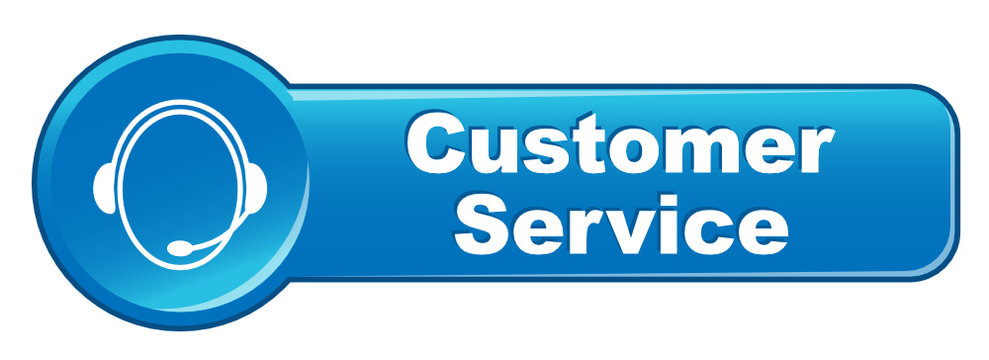

How to Contact Cable One Customer Service Support
============================================

.. toctree::
   :maxdepth: 2
   :caption: Contents:

Cable One, which is now called Sparklight, is a well-known company that offers phone, cable TV, and internet services in various parts of the United States. People know that its services are quick and dependable, although they may sometimes have problems with billing, technical issues, or service interruptions. That's where Cable One's customer support comes in. Customer care is the first place to go for help, whether you're a new customer who needs help with installation or a long-time user who is having trouble connecting. This tutorial tells you how to get in touch with Cable One customer support, what the best ways to do so are depending on your problem, and how to obtain help quickly and effectively.

Reasons You Might Need Cable One Customer Service
Cable One has a lot of different services, and sometimes clients need help with:

Questions about bills or payments

Problems in connecting to the Internet

Installing or fixing equipment

Service disruptions or outages

Changing or upgrading your service plans

Stopping or moving service

Managing your account in general

Cable One's customer service team is trained to quickly and professionally address both technical and non-technical problems.

How to Get in Touch with Cable One Customer Service

Help by phone
Calling Cable One is one of the quickest ways to get in touch with them. Customer service is usually open during business hours and can help with both technical and account-related problems. Be ready to give your account number and personal information when you call.

Support via live chat
The official Cable One (Sparklight) website has a live chat function that is an excellent alternative to calling. Chat agents can help with questions about billing, fixing problems, and other things. This is great for people who want a written record of their conversation or who want a quicker, easier solution.

Contact Forms and Email Support
Customers can also get in touch by email or by filling out a contact form on the website. This strategy is best for problems that don't need to be fixed right away and need more information or attachments. You should get a response within 24 to 48 hours after you send in your question.

Portal for Self-Service
Users can manage their services using the My Account site without having to talk to a representative. You can pay bills, see how much data you've used, fix internet problems, and even set up repair appointments all from the dashboard. This is a great choice for customers that know a lot about technology.

Help with mobile apps
The Sparklight mobile app makes it easy to use account features and get help from customer support. You can check your internet consumption, handle your bills, get warnings about service interruptions, and talk to support directly from your phone.

Support Centers in Person
Cable One maintains physical service stations in various cities for consumers who want help in person. You can go to a local office to talk to a representative about problems with your account, returning equipment, or upgrading your service.

Best Ways to Get in Touch with Customer Support

Get Your Information Ready
Before you call or text, make sure you have the following ready:

Your number of accounts

The address and name on the account

A full account of your problem

Any error messages or screenshots that are relevant

This information helps the representative help you faster.

Be Clear and Specific
Please explain your problem in a clear and short way. Tell us when the problem started, what you've done so far to fix it, and what kind of fix you want.

Follow Up If You Need To
If your problem isn't fixed the first time you call, don't be afraid to call again. Keep track of your conversations, including the names of the representatives you interacted with and any ticket numbers they gave you.

Customer service fixes a lot of problems.

Billing Problems: Get overcharges fixed, make billing dates clearer, or ask for reimbursements.

Slow Internet Speeds: Customer care can help you restart your modem, check for local outages, or set up a time for a technician to come to your house.

Service Upgrades or Downgrades: Find out what plans are available and adjust your current services.

Get help setting up or returning cable boxes, routers, or modems with Equipment Support.

Outage Reports: Find out if your area is affected by service interruptions and get information on when service will start again.

More Help Resources

Page for Help and Frequently Asked Questions
The Cable One website has a full help center with instructions on how to set up the internet, pay your payment, and more.

Forums for the community
Some users might find it helpful to look at customer discussion boards or forums where people talk about frequent problems and how to solve them.

Social Media Cable One also has customer service accounts on social media where people may send direct messages or submit questions to get help.

How to Improve Customer Service

Call During Off-Peak Hours: To prevent high wait times, try phoning early in the morning or late at night.

Be calm and polite. If you treat representatives with respect, they are more inclined to go above and above.

If you aren't obtaining results, ask to talk with a supervisor or ask for a callback.

The end
Cable One (Sparklight) customer service makes sure consumers may receive support in a number of ways, including over the phone, through chat, email, or self-service tools. Their crew is ready to help with anything from billing questions to tech support. If you know how to get ready and what ways to contact customer service, you can have a seamless and stress-free experience. Don't be afraid to reach out; help is only a click or a call away.
